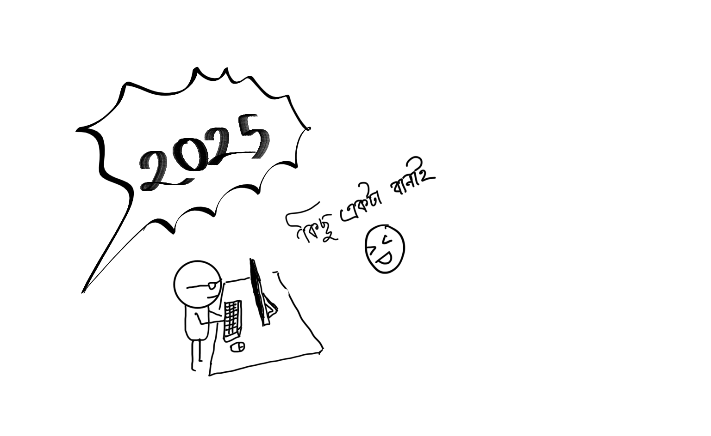

2025 was a year full of dreams. Let's end this year by making something meaningful, `A Dynamic Website` from scratch. It will be simple yet meaningful, fully working.  You can join us anyday. Just send me a mail. 

## __Current Group Members__
|Name | Github|
|---|---|
|1. Tanvir Rahman Tonoy| [Tanvir000Tonoy](https://github.com/Tanvir000Tonoy) |
|2. Riyadh  | [riyadh5674](https://github.com/riyadh5674)
|3. Shimul Sharker | [shimulsarker10](https://github.com/shimulsarker10)

<pre>
Dear Team!

I know this is something new 
for you. But I promise I will
help you to reach the ceilling,
 even I don't know anything in
advance yet I'm happy to be a 
part of this project. We will 
plan and grow this project. 
Let's finish this project and 
call it a year. 

Your friend, 
Tonoy!
</pre>

Here are the resouce that are required prior to jump into the project. 

- [HTML](https://www.w3schools.com/html/html_intro.asp)
- [CSS](https://www.w3schools.com/css/css_intro.asp)
- [JS](https://www.w3schools.com/js/default.asp)
- [PHP](https://www.w3schools.com/php/default.asp)

`recommended contents:`
1. [Edureka Web Development Tutorial.](https://youtu.be/Q33KBiDriJY?si=ptN0_gNu-ww70mK4)
2. [Harshit Vashisth  JS Tutorial](https://youtube.com/playlist?list=PLwgFb6VsUj_l3XGLgZTf5lXq9rPAQ9COu&si=hf4lWfHayR7V5zTO)

<!-- `Optional - for 2026`

- [MySQL](https://www.w3schools.com/mysql/default.asp)
- [React](https://www.w3schools.com/react/default.asp)
- [NodeJS](https://www.w3schools.com/nodejs/default.asp)
- [] -->
<!--  -->